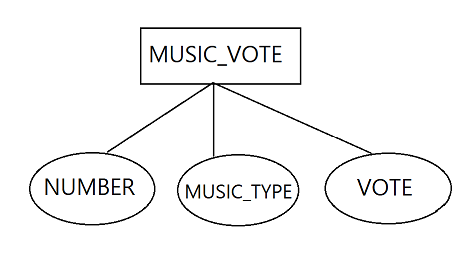

# DB Project_설문조사 어플리케이션 구현하기
## 1. 요구사항 정의
- 사용자의 요구 등을 정리 및 분석
    - 좋아하는 음악장르 설문조사
    - 데이터 초기화
    - 데이터 삽입
    - 설문참여
    - 설문항목변경
    - 설문현황
    - 최종투표결과 확인(통계)

<br/>

## 2. 데이터베이스 모델링
- 결과 동작을 위해 필요한 데이터
    - 개념적 모델링
        
        
        
    - 논리적 모델링
    
        
    
    - 물리적 모델링
        1. MUSIC_VOTE TABLE 생성
        
        ```sql
        CREATE TABLE "MUSIC_VOTE" (
        "NUMBER" NUMBER primary key,
        "MUSIC_TYPE" varchar2(100) not null,
        "VOTE" NUMBER
        );
        ```
        
        
        
<br/>

## 3. Console 출력 포맷 설계(UI)
- 콘솔 출력
    
    
    
    - 데이터가 남아있을 수 있으니 초기화(1번) 진행 후 프로그램 실행
        
        
        
        - 초기화되어 있을 경우 (3, 4, 5항목) 동일하게 콘솔출력
        
        
        
    - 사용자가 설문조사 항목을 추가(2번)하여 설문항목 세팅
        
        
        
    - 설문조사 참여(3번)로 항목(장르)마다 표 누적
        
        
        
    - 설문항목 이름변경(4번)하고자 하면 변경
        
        
        
    - 설문조사 진행 후 설문현황(5번) 결과 확인
        
        
        
    - 투표 진행 후 종료(6번), 최종 투표 수결과 확인
        
        
- 시현 영상
    

<br/>

## 4. 기능설계 : Class & Method
- MusicDao Class
    1. init : 데이터 초기화 메서드
        
        ```java
        // String 배열 사용
        // TRUNCATE TABLE "MUSIC_VOTE"; - 테이블 튜플 데이터 삭제
        // DROP SEQUENCE "M_V"; - 시퀀스 삭제
        // CREATE SEQUENCE "M_V" NOCACHE; - 시퀀스 생성
        String[] init = new String[] { "TRUNCATE TABLE \"MUSIC_VOTE\"",
        															"DROP SEQUENCE \"M_V\"",
        															"CREATE SEQUENCE \"M_V\" NOCACHE" };
        ```
        
    2. insertMusic : 초기화 되어 있는 상태에서 데이터(음악장르)를 삽입할 수 있는 메서드
        
        ```java
        // SEQUENCE 활용, MUSIC_TYPE 장르 등록하기
        String sql = "insert into \"MUSIC_VOTE\" values (\"M_V\".nextval, ?, 0)";
        ```
        
    3. selectAll : 설문항목을 확인할 수 있는 메서드
        
        ```java
        // ArrayList 활용, NUMBER 오름차순으로 정렬
        List<MusicVo> ls = new ArrayList<>();
        String sql = "select \"NUMBER\", \"MUSIC_TYPE\", \"VOTE\" from \"MUSIC_VOTE\" order by \"NUMBER\" ASC";
        ```
        
    4. countNum : 설문항목이 등록되었지만 선택지가 없을 경우 추가로 등록하기 위해 NUMBER 체크하는 메서드
        
        ```java
        // TABLE "MUSIC_VOTE"의 현재 NUMBER 수 체크
        String sql = "SELECT COUNT(\"NUMBER\") FROM MUSIC_VOTE";
        ```
        
    5. newmusic : 설문참여하기에 선택지가 없을 경우 새로운 음악장르를 등록하며 자동 1표가 누적되게 하는 메서드
        
        ```java
        // SEQUENCE 활용
        String sql = "INSERT INTO MUSIC_VOTE VALUES(M_V.NEXTVAL, ? , 1)";
        ```
        
    6. updatevote : 설문참여로 표가 누적되는 메서드
        
        ```java
        // VOTE 누적
        String sql = "UPDATE \"MUSIC_VOTE\" SET \"VOTE\" = \"VOTE\" + 1 WHERE \"NUMBER\" = ?";
        ```
        
    7. altermusic : 음악장르를 잘 못 입력했을 경우(오타, 띄어쓰기 등) 장르명을 변경할 수 있는 메서드
        
        ```java
        String sql = "update \"MUSIC_VOTE\" set \"MUSIC_TYPE\" = ? where \"NUMBER\" = ?";
        ```
        
    8. totalvote : 최종 투표 수 집계하는 메서드
        
        ```java
        // TABLE "MUSIC_VOTE"의 VOTE 합계 수(집계)
        String sql = "SELECT SUM(\"VOTE\") FROM \"MUSIC_VOTE\"";
        ```
        
 <br/>   

## 5. DataBase 결과물 확인

